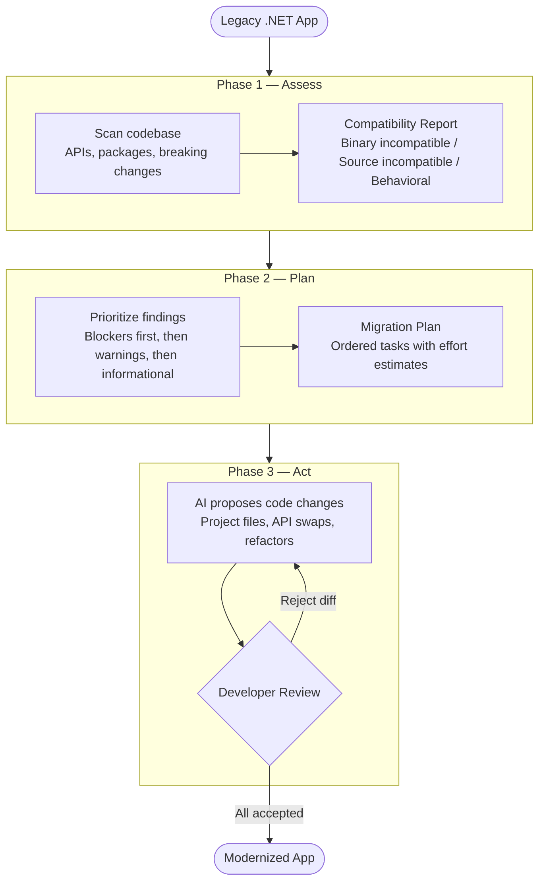
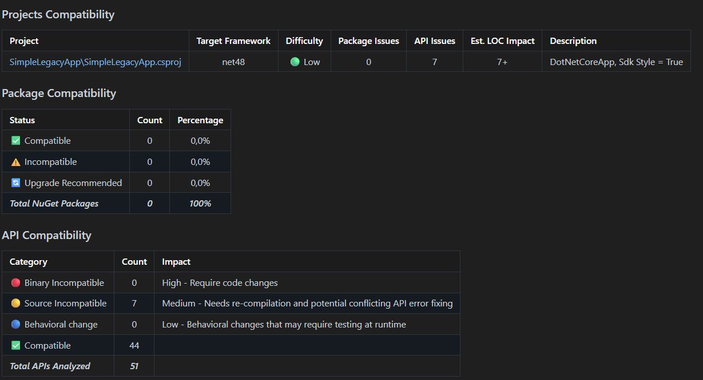

# Chapter 00: Introduction to Modernization
In this chapter you'll get started with the GitHub Copilot modernization agent and run your first assessment on a small sample app. Along the way you'll see why teams bother upgrading off .NET Framework, and you'll meet the Assess → Plan → Act loop the extension uses.

## 🎯 Learning Objectives

By the end of this chapter, you'll:
- Get started with the GitHub Copilot modernization agent in Visual Studio 2026
- Run your first compatibility assessment on a legacy .NET Framework app
- Understood the 3-phase model (Assess → Plan → Act) and how it structures every migration
- Interpreted an assessment report: binary incompatible vs. source incompatible vs. behavioral changes

---

## ✅ Prerequisites

| Requirement | Version / Notes |
|-------------|-----------------|
| **Windows** | Windows 11 (22H2 or later) — Visual Studio requires Windows. On macOS or Linux, use the extension via VS Code or GitHub.com instead. |
| **Visual Studio** | 2026, with .NET desktop development workload |
| **.NET 10 SDK** | Preview or latest release |
| **GitHub Copilot subscription** | Active subscription required |
| **Prior experience** | C#, Visual Studio basics |

> ⚠️ **Note:** This chapter includes extension installation. If you've already installed the GitHub Copilot app modernization extension, skip to the [Your First Assessment](#-your-first-assessment) section.

---

## 🤔 Why Modernize?

Your .NET Framework 4.8 app works fine today. Why touch it? A few honest reasons:

**.NET Framework isn't getting new features.** 4.8 and 4.8.1 are still supported and ship with Windows, but Microsoft's active investment has moved to modern .NET. 

**LTS releases give you a predictable patch window.** Even-numbered modern .NET releases (8, 10, ...) get 3 years of free patches. Odd-numbered ones get 18 months. That's useful for planning. 

**The runtime keeps getting faster.** Each annual release improves the JIT, GC, and ASP.NET Core pipeline. If you're curious how much, the "[Performance Improvements in .NET](https://devblogs.microsoft.com/dotnet/performance-improvements-in-net-10/)" posts are an exhausting read in the best way. 

**The package ecosystem moved.** Recent Azure SDKs, ML.NET, gRPC, and Aspire target modern .NET. The longer you stay on 4.x, the more new packages you can't pull in.

### Modernize vs. Rewrite vs. Retire

Not every app is worth modernizing. Before you start, decide which bucket yours falls in:

| Decision | When to Choose It | Example |
|----------|-------------------|---------|
| **Modernize** | The app still has business value, the code is in reasonable shape, and you want the security and ecosystem benefits. | An internal ASP.NET MVC app that processes orders. The logic is fine, but the dependencies are stale. |
| **Rewrite** | The code is a mess, or the architecture doesn't fit modern patterns at all. | A 200k-line Web Forms monolith with no tests and inline SQL throughout. Modernizing it would cost more than starting over. |
| **Retire** | Almost nobody uses it, or a SaaS product already does the job. | A custom HR portal used by five people. Microsoft 365 covers the same workflow. |

This course assumes you've picked **Modernize**. If you're not sure, run the assessment in this chapter first. The report is a decent reality check on how much work you're actually looking at.

---

## 🔧 What the Agent Does

The GitHub Copilot modernization agent walks your project through three phases: **Assess**, **Plan**, and **Execute**.

| Phase | What It Does | Output |
|-------|--------------|--------|
| **Assess** | Scans the codebase for compatibility issues: deprecated APIs, breaking changes, NuGet packages that don't have a modern equivalent. | A report that buckets findings as blockers (won't compile), warnings (deprecated but still works), or informational (worth doing eventually). |
| **Plan** | Turns the assessment into an ordered to-do list. Blockers first, then warnings, then the rest. | A migration plan with rough effort estimates. |
| **Execute** | Actually makes the changes: edits project files, swaps deprecated APIs, proposes refactors. The AI generates suggestions; you review each one. | Modified files with diffs you accept or reject. |

You're still the one driving. The extension proposes, you decide.



---

## 📦 Installing the Extension

Open Visual Studio 2026 and make sure you have the .NET desktop development workload with these optional components enabled: GitHub Copilot, GitHub Copilot app modernization.

Visual Studio includes GitHub Copilot modernization through the GitHub Copilot app modernization optional component, so you don't need to install it separately. Enable the GitHub Copilot and GitHub Copilot app modernization optional components in the .NET desktop development workload through the Visual Studio Installer.

**Verify the installation**
Open a solution in Visual Studio.
Right-click a project in Solution Explorer and select **Modernize**, or open GitHub Copilot Chat and type **@Modernize**.

---

## 🚀 Your First Assessment

Time to run an assessment on a small sample. It's a .NET Framework 4.8 console app with a couple of deliberately deprecated APIs, so the report has something to show you.

Open the sample:

1. Navigate to `00-introduction/code/` in this repo.
2. Open `SimpleLegacyApp.sln` in Visual Studio.

**Expected output:**

The solution loads with one project:

```
Solution 'SimpleLegacyApp' (1 of 1 project)
  └── SimpleLegacyApp (net48)
```

Trigger the assessment:

1. Right-click the project in Solution Explorer.
2. Select **Modernize**.
3. When the chat window opens, choose **Upgrade to a newer version of .NET**.
4. Send message.
5. After this initial message, the extension will take over and ask you which target framework you want. Write **".NET 10, Guided Mode and No Source Control"** and send.

 > ⚠️ **Guided vs. Flow Mode:** The extension has two modes. Flow Mode handles everything automatically. Guided Mode pauses after each phase so you can read the report before anything changes. Use Guided Mode here — the whole point of this chapter is to understand what the report is saying.

 > ⚠️ **Source control:** We're skipping it for this demo. On a real project, make sure you're on a clean Git branch before running Act — you'll want to be able to diff or roll back.

**Expected output:**

The extension scans the code and produces a compatibility report. Expect 30–60 seconds.

When complete, the report opens in a new tab:



### Reading the Report

The report is a markdown file called **Projects and dependencies analysis**. It's long, so here's where to look first.

The **High-level Metrics** table near the top gives you the big picture:

| Metric | Count |
| :--- | :---: |
| Total Projects | 1 |
| Total NuGet Packages | 0 |
| Total Code Files | 2 |
| Total Lines of Code | 81 |
| Total Number of Issues | 8 |
| Estimated LOC to modify | 7+ (~8.6% of the codebase) |

For this sample, 7 lines out of 81. That's nothing. On a real app, the "Estimated LOC to modify" row is the first honest signal of how big the job is.

Below that, the **API Compatibility** section breaks issues into three categories:

| Category | What it means |
| :--- | :--- |
| 🔴 **Binary Incompatible** | The API is gone. Won't build. |
| 🟡 **Source Incompatible** | The API changed enough that you need to edit and recompile. |
| 🔵 **Behavioral change** | Compiles fine, behaves differently at runtime. Tests catch these. |

All 7 of our issues are Source Incompatible. 44 of the 51 APIs analyzed are already fine and don't need touching.

The **Technologies and Features** section groups those 7 issues by area, which is more useful than a raw API list:

- **ASP.NET Framework (System.Web)** — 3 issues. `System.Web.*` doesn't exist in ASP.NET Core. Migrate to ASP.NET Core equivalents, or use `System.Web.Adapters` as a temporary bridge.
- **Legacy Configuration System** — 2 issues. `ConfigurationManager` and `app.config` are replaced by `Microsoft.Extensions.Configuration`.
- **Deprecated Remoting & Serialization** — 2 issues. `BinaryFormatter` is removed. `System.Text.Json` or protobuf are the go-to replacements.

The **Most Frequent API Issues** table at the bottom lists the specific types: `System.Web.HttpContext` twice, `BinaryFormatter` twice, `ConfigurationManager` twice. Memorize these names — they'll come up again in Chapter 02 when the extension proposes actual code edits.

None of this is fixed yet. The Assess phase only tells you what's there. Plan and Act are in Chapter 02.

---

## ✅ You're Ready!

First assessment done and report read. You know what a blocker is versus a warning, and you've understood the Assess → Plan → Act flow.

Chapter 01 puts the same workflow against something bigger: BookCatalog, an ASP.NET MVC 5 app. You'll run a full assessment, generate an upgrade plan, and set up for the modernization in Chapter 02.

**[Continue to Chapter 01: Assessment →](../01-assessment/README.md)**

## 🛠️ Troubleshooting

**Problem:** The assessment starts but fails with "Unable to analyze project."

**Solution:** Check that your project is on a supported source framework. The modernization agent supports **.NET Framework (any version)**, **.NET Core 1.x–3.x**, and **.NET 5 or later** as source frameworks, with **.NET 8 or later** as the target. Verify the `<TargetFramework>` (or `<TargetFrameworkVersion>` for legacy `.csproj`) value in your project file.

📘 **Learn more:** [Supported upgrade paths — GitHub Copilot modernization overview](https://learn.microsoft.com/dotnet/core/porting/github-copilot-app-modernization-overview#supported-upgrade-paths)

---

**Problem:** GitHub Copilot shows "Not signed in" in the extension settings.

**Solution:** Sign in to GitHub via **Tools** → **Options** → **GitHub** → **Account**. Your account must have an active Copilot subscription (individual, business, or enterprise).

📘 **Learn more:** [Set up GitHub Copilot in Visual Studio](https://learn.microsoft.com/en-us/dotnet/core/porting/github-copilot-app-modernization/install?pivots=visualstudio)

---

## 📚 Learn More

A few useful follow-ups:

- 📘 [GitHub Copilot modernization for .NET — overview](https://learn.microsoft.com/dotnet/core/porting/github-copilot-app-modernization/overview) — the extension and the Assess → Plan → Act flow.
- 📘 [Port from .NET Framework to .NET](https://learn.microsoft.com/dotnet/core/porting/) — the canonical porting guide.
- 📘 [.NET and .NET Framework support policy](https://dotnet.microsoft.com/platform/support/policy/dotnet-framework) — official end-of-support dates.
- 📘 [`BinaryFormatter` security guide](https://learn.microsoft.com/dotnet/standard/serialization/binaryformatter-security-guide) — why it's deprecated and what to use instead.
- 📘 [Strangler Fig pattern](https://learn.microsoft.com/azure/architecture/patterns/strangler-fig) — incremental modernization without a big-bang rewrite.

---

