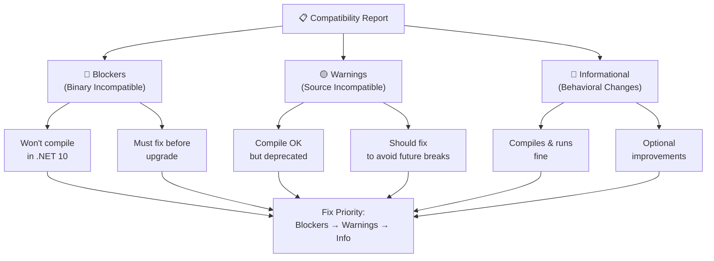

You've installed the extension and run a preview assessment on a simple sample. Now it's time to run the full Assess → Plan workflow on a real legacy app: BookCatalog, an ASP.NET MVC 5 application running on .NET Framework 4.8. In this chapter, you'll scan BookCatalog, interpret what blockers (breaks compilation) versus warnings (deprecated but works) versus informational (nice-to-have) mean for your timeline, and generate a prioritized upgrade plan you'll execute in Chapter 02.

## 🎯 Learning Objectives

By the end of this chapter, you'll have:
- Run a full Assess → Plan workflow on BookCatalog using the GitHub Copilot app modernization extension in Guided Mode
- Read a compatibility report: identified which findings are blockers (must fix), warnings (should fix), and informational (optional)
- Understood the difference between binary incompatible (won't compile), source incompatible (needs code edits), and behavioral changes (runtime surprises)
- Generated a prioritized upgrade plan ordered by impact

---

## ✅ Prerequisites

**From Chapter 00:**
- GitHub Copilot app modernization extension installed in Visual Studio 2022 or 2026
- Understanding of the Assess → Plan → Act loop

**For This Chapter:**
- Visual Studio 2022 (17.12 or later) or 2026
- .NET Framework 4.8 SDK
- .NET 10 SDK

---

## 📂 Opening the BookCatalog App

BookCatalog is the sample you'll upgrade through Chapters 01–02. It's a small ASP.NET MVC 5 app with one controller, two models, and a SQL database context on Entity Framework 6. It works fine today on .NET Framework 4.8.

Open the solution:

1. Navigate to `shared-legacy-app/` in this repo.
2. Open `BookCatalog.sln` in Visual Studio 2022 or 2026.

**Expected output:**

```
Solution 'BookCatalog' (1 of 1 project)
  └── BookCatalog.Web (net48)
```

Build it to verify it compiles:

1. Press **Ctrl+Shift+B**.

**Expected output:**

```
Build succeeded.
    0 Warning(s)
    0 Error(s)
```

---

## 🔍 Running the Assessment

Trigger the extension using the same path as Chapter 00, but this time you'll go through both Assess and Plan phases (not just Assess):

1. Right-click the **BookCatalog.Web** project in Solution Explorer.
2. Select **Modernize**.
3. When the chat window opens, choose **Upgrade to a newer version of .NET**.
4. Send the message.
5. The extension asks you for the target framework. Type: **".NET 10, Guided Mode and No Source Control"**
6. Send.

**Expected output:**

The extension scans the code, dependencies, and project configuration. This takes 1–2 minutes:


When done, a compatibility report opens in a new tab:


> 💡 **Guided vs. Flow Mode:** You're running Guided Mode, which pauses after Assess so you can read the report before Plan starts. Flow Mode automates everything. Guided lets you understand each phase.

---

## 📊 Reading the Compatibility Report

The report has three categories. Understanding them is the whole point of Assess—you read first, then plan:



### Blockers: Won't Compile

Click the **Blockers** section. Here's what you'll see:

**System.Web.Mvc**

```
System.Web.Mvc is not available in .NET 10
  Location: BookCatalog.Web/Controllers/BooksController.cs (line 4, 9)
  Found: using System.Web.Mvc; ... public class BooksController : Controller
  Fix: Migrate to ASP.NET Core. Replace System.Web.Mvc.Controller 
       with Microsoft.AspNetCore.Mvc.Controller
  Impact: High — 1 controller affected; RouteConfig and FilterConfig also reference System.Web.Mvc
```

This blocker stops the build. `System.Web` doesn't ship with .NET 10 — it's Windows-only and tied to IIS. Without fixing it, your code won't compile.

**Entity Framework 6**

```
Entity Framework 6 is not available in .NET 10
  Location: BookCatalog.Web/Models/ApplicationDbContext.cs
  Found: using System.Data.Entity;
  Fix: Migrate to Entity Framework Core 9 or later. 
       Regenerate DbContext using `dotnet ef dbcontext scaffold`.
  Impact: High — All database operations depend on this
```

Another blocker. EF6 has a hard dependency on `System.Data.Entity` which doesn't exist in .NET 10; you need EF Core.

### Warnings: Deprecated but Works

Click the **Warnings** section:

**HttpContext.Current**

```
HttpContext.Current is deprecated in .NET 10
  Location: BookCatalog.Web/Controllers/BooksController.cs (line 17)
  Found: var userAgent = HttpContext.Current.Request.UserAgent;
  Fix: Inject IHttpContextAccessor instead of using static HttpContext.Current
  Impact: Medium — Better for DI, still works in current version
```

This compiles fine on .NET 10, but it's a static reference. Modern code uses dependency injection instead.

### Informational: Nice-to-Have

**System.Configuration**

```
Consider migrating from app.config to appsettings.json
  Location: BookCatalog.Web/App.config
  Benefit: appsettings.json is easier to override per environment
  Impact: Low — App.config still works; this is a quality improvement
```

Optional. The upgrade doesn't depend on it.

---

## ✅ What the Report Means for Your Timeline

| Finding Type | BookCatalog Count | Action | Time |
|:---|:---:|:---|:---|
| **Blockers** | 2 | Must fix | Must do now |
| **Warnings** | 2 | Should fix | Can defer 1–2 sprints |
| **Informational** | 1 | Nice-to-have | After upgrade |

Blockers mean the app won't run. Warnings mean it *will* run but carries technical debt. Informational is polish.

---

## 🗺️ Generating the Upgrade Plan

Once you've read the report in your Guided Mode session, the extension asks: **"Ready to plan?"** Say yes.

The extension moves to the **Plan** phase. It takes the blockers, warnings, and informational findings and prioritizes them into tasks:

**Expected output:**

A migration plan opens with this structure:

```
# BookCatalog Upgrade Plan

## Phase 1: Fix Blockers (Required)
1. Migrate from System.Web.Mvc to ASP.NET Core MVC
   - Update BooksController to inherit from Microsoft.AspNetCore.Mvc.Controller
   - Replace ActionResult with IActionResult
   - Update RouteConfig.cs and FilterConfig.cs for ASP.NET Core routing
   - Estimated effort: 3–4 hours

2. Migrate from Entity Framework 6 to Entity Framework Core 9
   - Scaffold ApplicationDbContext with new schema
   - Update LINQ queries for EF Core APIs
   - Estimated effort: 4–5 hours

## Phase 2: Fix Warnings (Recommended)
1. Replace HttpContext.Current with IHttpContextAccessor
   - Inject into controller constructor
   - Update access pattern
   - Estimated effort: 1 hour

2. Migrate app.config settings to appsettings.json
   - Extract connection string, API keys, etc.
   - Use Microsoft.Extensions.Configuration
   - Estimated effort: 1 hour

## Phase 3: Informational (Optional)
- (No tasks; all informational items are low-priority polish)
```

Export the plan to share with your team:

1. Look for **Export Plan** button at the bottom of the plan tab.
2. Choose **Markdown** or **JSON**.
3. Save to your project folder.

This plan is now your roadmap for Chapter 02.

---

## ✅ You're Ready!

You've run Assess → Plan on a real app, read the compatibility report, and understand what blockers vs. warnings vs. informational mean. You know which changes will block the upgrade (blockers) and which are best practices (warnings and info). In Chapter 02, you'll execute the Act phase: let the extension propose code changes, review them, and modernize BookCatalog to run on .NET 10.

**[Continue to Chapter 02: Modernizing →](../02-modernizing/README.md)**

---

## 🔑 Key Takeaways

1. **Blockers break compilation.** They're APIs that don't exist in .NET 10 (System.Web.Mvc, Entity Framework 6, BundleConfig). Must fix them.
2. **Warnings are deprecated patterns.** They compile on .NET 10 but indicate old code (HttpContext.Current, app.config). Should fix them to avoid future breaks.
3. **Informational findings are optional improvements.** Lower priority; fix them after the upgrade if at all.
4. **The upgrade plan prioritizes by impact:** blockers first (hard deadline), warnings second (best practice), informational last (nice-to-have).
5. **Export your plan to share with your team or track in your backlog.**

---

## 🛠️ Troubleshooting

**Problem:** The assessment fails with "Unable to analyze project."

**Solution:** Restore NuGet packages first. Right-click the solution in Solution Explorer → **Restore NuGet Packages**. Wait for completion, then retry the assessment.

---

**Problem:** The report shows blockers, but I expected fewer (or more).

**Solution:** The extension scans for all uses of unsupported APIs. Small differences are normal. If you spot something that looks wrong, note the line number and check the code file directly—there may be a false positive worth reporting.

---

**Problem:** I'm in Flow Mode instead of Guided Mode.

**Solution:** When the extension asks for target framework, type exactly: **".NET 10, Guided Mode and No Source Control"**. This ensures you pause after Assess to read the report before Plan starts. Flow Mode automates everything; we want you to read and understand first.

---

## 📚 Learn More

- 📘 [GitHub Copilot app modernization for .NET](https://learn.microsoft.com/dotnet/core/porting/github-copilot-app-modernization-overview) — how Assess → Plan → Act works
- 📘 [Port from .NET Framework to .NET](https://learn.microsoft.com/dotnet/core/porting/) — the full migration guide
- 📘 [Migrate from System.Web to ASP.NET Core](https://learn.microsoft.com/dotnet/core/porting/net-framework-to-core-migration) — technical deep dive on the biggest blocker
- 📘 [Migrate to Entity Framework Core](https://learn.microsoft.com/ef/core/what-is-new/ef6-efcore-porting/) — how to move from EF6 to EF Core
