# Chapter 01: Assessment
You ran a preview assessment on a simple sample. Now it's time to run the full assessment workflow on a real legacy app: BookCatalog, an ASP.NET MVC 5 application running on .NET Framework 4.8.

In this chapter, you'll scan BookCatalog and interpret what blockers (breaks compilation) versus warnings (deprecated but works) versus informational (nice-to-have) mean for your timeline.

## 🎯 Learning Objectives

By the end of this chapter, you'll have:
- Run a full assessment workflow on BookCatalog using the GitHub Copilot modernization agent in Guided Mode
- Read a compatibility report: identified which findings are blockers (must fix), warnings (should fix), and informational (optional)
- Understood the difference between binary incompatible (won't compile), source incompatible (needs code edits), and behavioral changes (runtime surprises)
- Produced an assessment-ready handoff for planning in Chapter 02

---

## ✅ Prerequisites

**From Chapter 00:**
- Getting started with the GitHub Copilot modernization agent in Visual Studio 2026
- Understanding of the Assess → Plan → Act loop

**For This Chapter:**
- Visual Studio 2026
- .NET Framework 4.8 SDK
- .NET 10 SDK

---

## 📂 Opening the BookCatalog App

BookCatalog is the sample you'll upgrade through Chapters 01–02. It's a small ASP.NET MVC 5 app with one controller, two models, and a SQL database context on Entity Framework 6. It works fine today on .NET Framework 4.8.

Open the solution:

1. Navigate to `shared-legacy-app/` in this repo.
2. Open `BookCatalog.sln` in Visual Studio 2026.

**Expected output:**

```
Solution 'BookCatalog' (1 of 1 project)
  └── BookCatalog.Web (net48)
```

Build it to verify it compiles:

1. Press **Ctrl+Shift+B**.

**Expected output:**

```
Build succeeded.
    0 Warning(s)
    0 Error(s)
```

2. Run the app (F5) to verify it works:

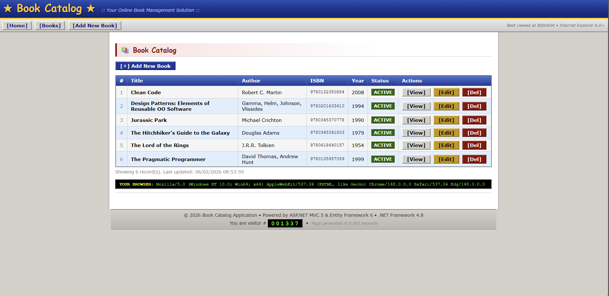

This app is a realistic sample of a legacy .NET Framework app. It has common blockers like `System.Web.Mvc` and `Entity Framework 6`. Being a simple app, like many real-world apps, it has a mix of blockers, warnings, and informational findings that will help you learn how to read the compatibility report and prioritize your upgrade plan.

---

## 🔍 Running the Assessment

Trigger the agent using the same path as Chapter 00, but this time you'll go through both Assess and Plan phases (not just Assess):


1. Right-click the **solution** in Solution Explorer.
2. Select **Modernize**.

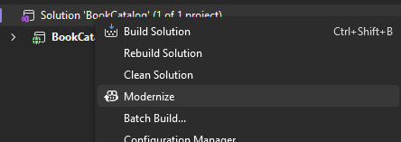

When the chat window opens, notice that we have options to customize the workflow. Selecting the model and options for modernization. Those options currently include:
- Upgrade to a newer version of .NET (e.g., .NET 10)
- Migrate to Azure
- Explore more modernization options

Plus, you can write your own custom instructions in the chat window.

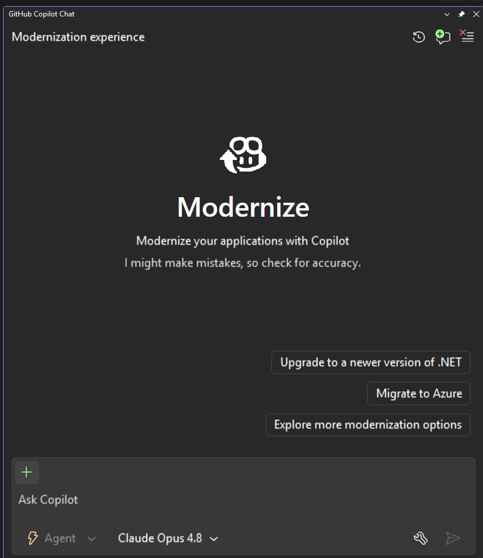

We'll select to "Upgrade to a newer version of .NET". Our goal is the same as Chapter 00, to upgrade to .NET 10. Click and send the message.

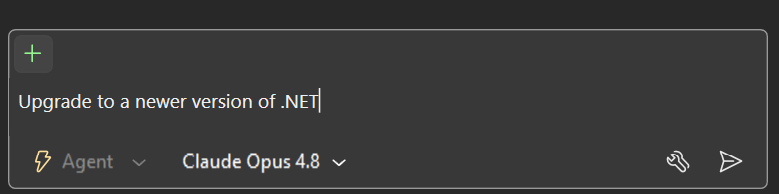

The agent confirms it's starting the workflow and runs a quick state check on your solution:

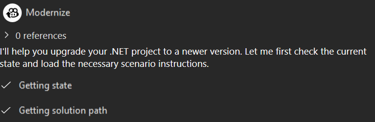

It then asks for permission to run a `cd` and inspect the git status of the workspace. Click **Confirm** to allow it.

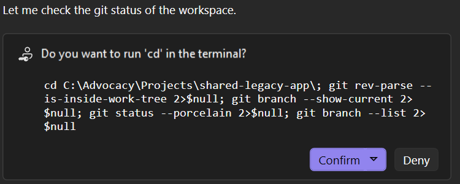

Once initialized, the agent shows the **Upgrade Settings** with the available target frameworks. The default is .NET 10.0 (LTS):

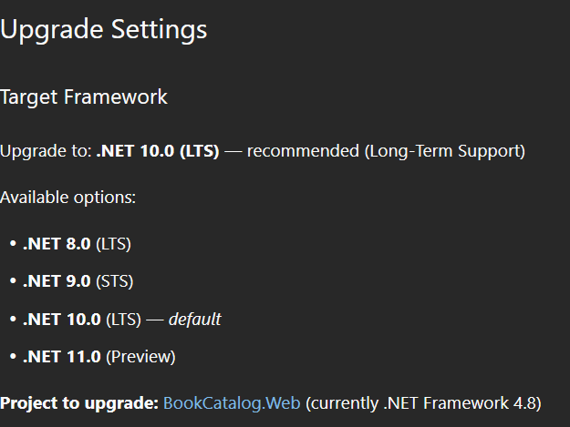

Right below, it lists the available **Flow Mode** options — *Automatic* (default) runs end-to-end, *Guided* pauses after each stage so you can review:

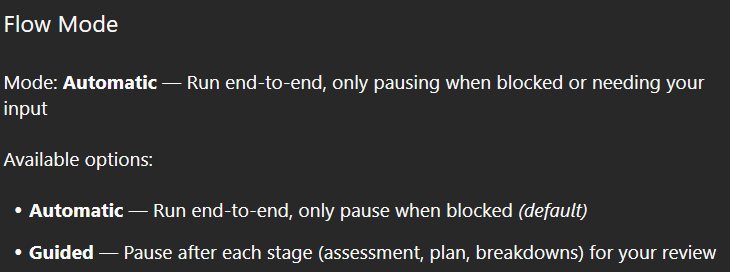

The agent asks you for the target framework. Type: **".NET 10, Guided Mode"**. 

About source control, you can choose to let the agent create a new branch for the upgrade or skip source control if you prefer to manage it yourself. For this demo, we'll select **Skip source control** to keep things simple, but in a real project, you'd likely want to use source control to track changes and collaborate with your team. Plus, the ability to roll back any undesirable changes can be key when running automated code modifications.


The agent echoes back the choices you made so you can verify them before it kicks off the scan:

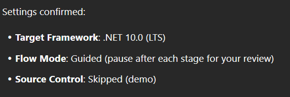

It then enters the **Assessment** stage and asks for permission to read the `assessment.md` instructions from the agent's skill folder. Click **Confirm** (or **Always allow** for this session).

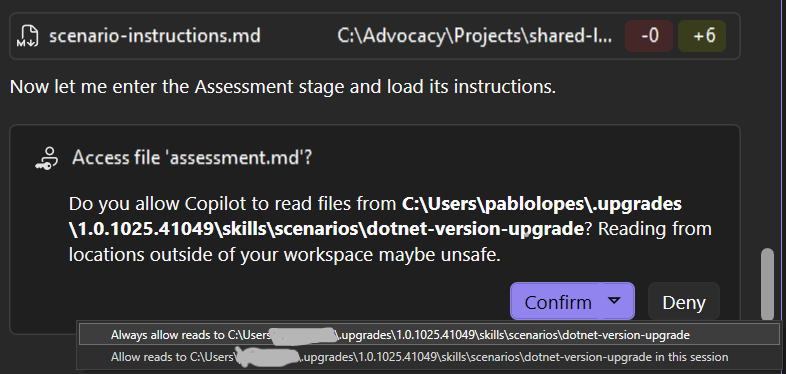

The agent scans the code, dependencies, and project configuration. This takes 1–2 minutes! During this time, it looks for known blockers (APIs that won't compile on the target framework), warnings (APIs that are deprecated but still compile), and informational findings (APIs that work but have better alternatives). It also gathers context on the project structure, dependencies, and code patterns to generate a comprehensive compatibility report.

When done, the agent posts an **Assessment Complete** summary in the chat with the project, current and target frameworks, and an overall difficulty rating:

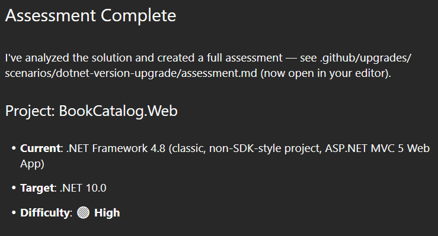

Right after, it lists the **Main Challenges** it found — the architectural conversions you'll need to make (not just a TFM bump):


Finally, a full compatibility report opens in a new tab:

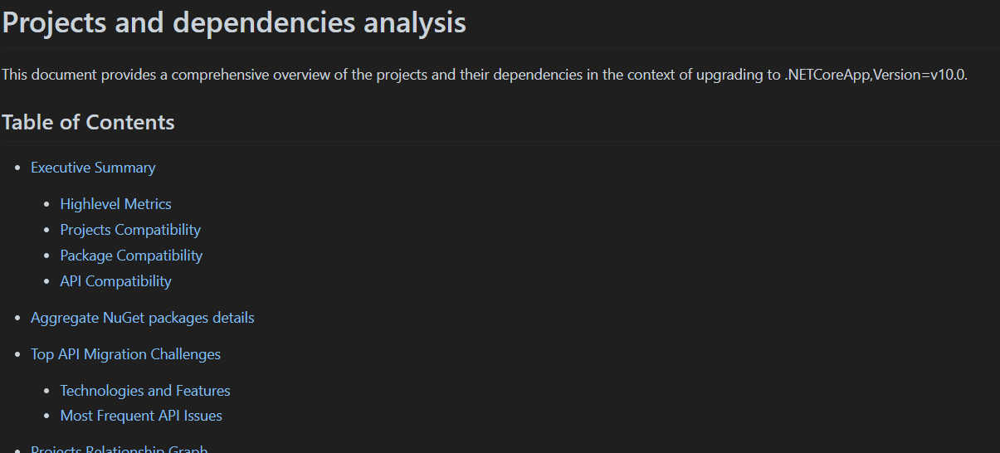

> 💡 **Guided vs. Flow Mode:** You're running Guided Mode, which pauses after Assess so you can read the report before Plan starts. Flow Mode automates everything. Guided lets you understand each phase.

---

## 📊 Reading the Compatibility Report

### Decision Lens
Use the report to answer three decisions before touching code:
- What can block compilation immediately?
- What should be sequenced early because it has high downstream impact?
- What can be deferred safely with explicit risk notes?

### Artifact Breakdown
Read the assessment artifact in this order:
1. Executive metrics (size, issue concentration, impacted files)
2. API compatibility categories (binary, source, behavioral)
3. Technology clusters (where migration effort is concentrated)
4. Most frequent issues (mechanical replacement candidates)
5. Project details (project-kind and SDK conversion implications)

The report that opens is a Markdown document titled **"Projects and dependencies analysis"**. It's structured top-down, from the 30,000-ft view to the per-project drill-down. Before diving into the sections, it helps to keep the three API categories in mind — they show up everywhere in the report:

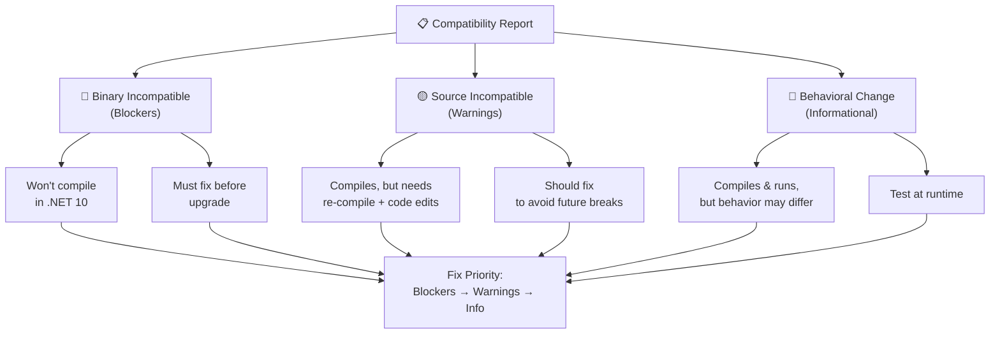

Now let's walk through each section of the report as it renders in the editor.

### Executive Summary

The first section is a quick health check on your solution. It opens with a **Highlevel Metrics** table that tells you how big the upgrade actually is:

| Metric | Count | Status |
| :--- | :---: | :--- |
| Total Projects | 1 | All require upgrade |
| Total NuGet Packages | 6 | 2 need upgrade |
| Total Code Files | 14 |  |
| Total Code Files with Incidents | 6 |  |
| Total Lines of Code | 633 |  |
| Total Number of Issues | 105 | 89 API issues + 7 package issues + 9 project structure issues |
| Estimated LOC to modify | 89+ | at least 14,1% of codebase |

Roughly **14% of BookCatalog's code will need to change** — concentrated in 6 of 14 files. That's small for a real-world migration, but the per-issue mix matters more than the absolute count.

Next, the **Projects Compatibility** table grades each project with a difficulty rating and links straight to its detailed section:

| Project | Target Framework | Difficulty | Package Issues | API Issues | Est. LOC Impact | Description |
| :--- | :---: | :---: | :---: | :---: | :---: | :--- |
| src\BookCatalog.Web\BookCatalog.Web.csproj | net48 | 🔴 High | 7 | 89 | 89+ | Wap, Sdk Style = False |

🔴 **High** here is driven by two things: it's a non-SDK-style **Wap** (Web Application Project), and it has 89 API issues — all in `System.Web.*`. Both signals tell you this is an architectural conversion, not a TFM bump.

The **Package Compatibility** and **API Compatibility** tables break down what's salvageable vs. what needs replacing:

| Status | Count | Percentage |
| :--- | :---: | :---: |
| ✅ Compatible | 4 | 66,7% |
| ⚠️ Incompatible | 0 | 0,0% |
| 🔄 Upgrade Recommended | 2 | 33,3% |
| ***Total NuGet Packages*** | ***6*** | ***100%*** |

| Category | Count | Impact |
| :--- | :---: | :--- |
| 🔴 Binary Incompatible | 83 | High - Require code changes |
| 🟡 Source Incompatible | 6 | Medium - Needs re-compilation and potential conflicting API error fixing |
| 🔵 Behavioral change | 0 | Low - Behavioral changes that may require testing at runtime |
| ✅ Compatible | 237 |  |
| ***Total APIs Analyzed*** | ***326*** |  |

Good news: **no packages are flat-out incompatible** — every NuGet has a path forward. Bad news: **83 binary-incompatible API calls** mean a lot of `using System.Web.Mvc` references won't even compile on .NET 10.

### Aggregate NuGet packages details

This section lists every package, its current version, the suggested target version, and what to do about it:

| Package | Current Version | Suggested Version | Description |
| :--- | :---: | :---: | :--- |
| EntityFramework | 6.4.4 | 6.5.2 | NuGet package upgrade is recommended |
| Microsoft.AspNet.Mvc | 5.2.9 |  | NuGet package functionality is included with framework reference |
| Microsoft.AspNet.Razor | 3.2.9 |  | NuGet package functionality is included with framework reference |
| Microsoft.AspNet.WebPages | 3.2.9 |  | NuGet package functionality is included with framework reference |
| Microsoft.Web.Infrastructure | 2.0.0 |  | NuGet package functionality is included with framework reference |
| Newtonsoft.Json | 13.0.3 | 13.0.4 | NuGet package upgrade is recommended |

Notice that four `Microsoft.AspNet.*` packages have no suggested version — that's the report telling you those are **rolled into the ASP.NET Core framework reference**, so you'll remove the explicit NuGet references entirely. Only `EntityFramework` and `Newtonsoft.Json` get straight version bumps.

### Top API Migration Challenges

This is the most actionable section. It groups the 89 API issues by **technology family** so you can see where to focus:

| Technology | Issues | Percentage | Migration Path |
| :--- | :---: | :---: | :--- |
| ASP.NET Framework (System.Web) | 89 | 100,0% | Legacy ASP.NET Framework APIs for web applications (System.Web.*) that don't exist in ASP.NET Core due to architectural differences. ASP.NET Core represents a complete redesign of the web framework. Migrate to ASP.NET Core equivalents or consider System.Web.Adapters package for compatibility. |

**100% of the API issues are `System.Web.*`** — every blocker traces back to the same root cause. Fix the framework migration and you've solved the whole list.

Right below, the **Most Frequent API Issues** table ranks individual APIs by hit count. The top of the list tells you exactly what your replace-with-ASP.NET-Core work will look like:

| API | Count | Percentage | Category |
| :--- | :---: | :---: | :--- |
| T:System.Web.Mvc.ActionResult | 8 | 9,0% | Binary Incompatible |
| T:System.Web.Mvc.ViewResult | 7 | 7,9% | Binary Incompatible |
| M:System.Web.Mvc.Controller.View(System.Object) | 6 | 6,7% | Binary Incompatible |
| T:System.Web.Mvc.HttpNotFoundResult | 4 | 4,5% | Binary Incompatible |
| M:System.Web.Mvc.Controller.HttpNotFound | 4 | 4,5% | Binary Incompatible |
| T:System.Web.Mvc.ValidateAntiForgeryTokenAttribute | 3 | 3,4% | Binary Incompatible |
| T:System.Web.Mvc.HttpPostAttribute | 3 | 3,4% | Binary Incompatible |
| T:System.Web.Mvc.RedirectToRouteResult | 3 | 3,4% | Binary Incompatible |
| T:System.Web.Mvc.UrlParameter | 3 | 3,4% | Binary Incompatible |
| T:System.Web.HttpContextBase | 1 | 1,1% | Source Incompatible |
| P:System.Web.HttpRequestBase.UserAgent | 1 | 1,1% | Source Incompatible |
| T:System.Web.HttpApplication | 1 | 1,1% | Source Incompatible |

> 💡 **API prefix legend:** `T:` = type, `M:` = method, `P:` = property, `F:` = field. These prefixes come from .NET's XML documentation format.

The pattern is clear: replace `System.Web.Mvc.ActionResult` / `ViewResult` with `Microsoft.AspNetCore.Mvc.IActionResult` / `ViewResult`, swap attributes (`[HttpPost]`, `[ValidateAntiForgeryToken]`) for their `Microsoft.AspNetCore.Mvc` equivalents, and the 83 binary-incompatible hits collapse into a handful of mechanical edits.

The 6 **Source Incompatible** items (`HttpContextBase`, `HttpRequestBase.UserAgent`, `HttpApplication`) are the ones where you'll need an `IHttpContextAccessor` and a new `Program.cs` startup pattern — exactly the "Global.asax.cs → Program.cs" challenge from the assessment summary.

### Projects Relationship Graph

For BookCatalog this section is short — one project, no dependencies — but on larger solutions it becomes invaluable. It renders a Mermaid graph showing which projects depend on which, and marks each one as SDK-style (📦) or classic (⚙️):

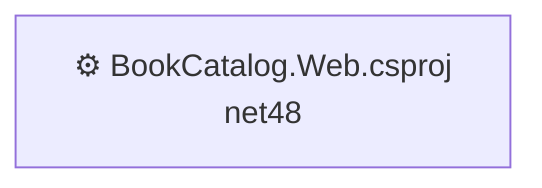

When you have a multi-project solution, this graph dictates your upgrade order: **start at the leaves and work toward the roots**, so dependencies are already on .NET 10 by the time you upgrade the project that consumes them.

### Project Details

The final section drills into each project individually. For `BookCatalog.Web.csproj` you get the same shape of report as the executive summary, but scoped to that one project — Project Info, a per-project Dependency Graph, an API Compatibility breakdown, and the Technologies and Features list.

The **Project Info** block is the cheat sheet for what kind of conversion you're signing up for:

- **Current Target Framework:** net48
- **Proposed Target Framework:** net10.0
- **SDK-style**: False
- **Project Kind:** Wap
- **Number of Files**: 19
- **Number of Files with Incidents**: 6
- **Lines of Code**: 633
- **Estimated LOC to modify**: 89+ (at least 14,1% of the project)

`SDK-style: False` + `Project Kind: Wap` is the combination that earns the 🔴 High rating: before you can even start fixing API calls, the project file itself has to be rewritten in SDK-style format.

---

## ✅ What the Report Means for Your Timeline

Boiling the whole report down to one decision-making table:

| Finding Type | BookCatalog Count | Action | Effort Signal |
|:---|:---:|:---|:---|
| 🔴 **Binary Incompatible** (Blockers) | 83 | Must fix — won't compile on .NET 10 | Mostly mechanical: `System.Web.Mvc.*` → `Microsoft.AspNetCore.Mvc.*` |
| 🟡 **Source Incompatible** (Warnings) | 6 | Should fix — needs re-compile + small code edits | Architectural: `HttpContext` access pattern, `HttpApplication` → `Program.cs` |
| 🔵 **Behavioral Change** (Informational) | 0 | None this run | — |
| 📦 **Packages to upgrade** | 2 | EF6 → 6.5.2, Newtonsoft.Json → 13.0.4 | Version bumps |
| 📦 **Packages to remove** | 4 | The `Microsoft.AspNet.*` set | Rolled into the framework reference |

The headline numbers (83 / 6 / 0) come straight from the report's API Compatibility table. Together they tell you this is a **one-developer, few-day migration** dominated by find-and-replace work on MVC types, plus one real architectural change (Global.asax → Program.cs).

Remember, **you can edit the assessment to add knowledge or context** that the agent might have missed. For example, if you know that some of those `System.Web.Mvc` hits are in files that are only used for legacy admin pages, you might downgrade their priority from "must fix" to "should fix" and mark them as informational. Or if you have a test project that also has blockers but it's not critical to get running on .NET 10, you could deprioritize it in the plan. 


---

## ✅ You're Ready!

You've run Assess → Plan on a real app, read the compatibility report, and understand what blockers vs. warnings vs. informational mean. You know which changes will block the upgrade (blockers) and which are best practices (warnings and info). In Chapter 02, you'll execute the Act phase: let the agent propose code changes, review them, and modernize BookCatalog to run on .NET 10.

**[Continue to Chapter 02: Planning →](../02-planning/README.md)**

---

## 🔑 Key Takeaways

1. **The report reads top-down.** Executive Summary first (size and difficulty), then NuGet packages, then API challenges, then per-project drill-downs. You don't have to read every row — the summary tables tell you where to focus.
2. **Binary Incompatible = blockers.** 83 hits in BookCatalog, all `System.Web.Mvc.*`. These won't compile on .NET 10 and must be replaced (mostly with `Microsoft.AspNetCore.Mvc.*` equivalents).
3. **Source Incompatible = re-compile + small edits.** Only 6 hits, but they're the architectural ones (`HttpContextBase`, `HttpApplication`) that push you toward `IHttpContextAccessor` and `Program.cs`.
4. **Behavioral Change = test at runtime.** None this run — the upgrade should behave the same once it compiles.
5. **Packages split into three buckets:** keep as-is (✅), bump the version (🔄), or remove because the framework now provides it (no suggested version). For BookCatalog: 4 keep, 2 bump, 4 of those keepers are actually getting absorbed into the ASP.NET Core framework reference.
6. **Difficulty rating ≠ effort estimate.** 🔴 High here means *architectural conversion required*, not *hundreds of hours*. The 89 LOC and one-technology concentration make this a small migration with a scary-looking label.
7. **Assessment quality determines planning quality.** Clear categorization of blockers, warnings, and behavior-risk items is what makes the planning chapter actionable rather than speculative.

---

## 🛠️ Troubleshooting

**Problem:** The assessment fails with "Unable to analyze project."

**Solution:** Restore NuGet packages first. Right-click the solution in Solution Explorer → **Restore NuGet Packages**. Wait for completion, then retry the assessment.

---

**Problem:** The report shows blockers, but I expected fewer (or more).

**Solution:** The agent scans for all uses of unsupported APIs. Small differences are normal. If you spot something that looks wrong, note the line number and check the code file directly—there may be a false positive worth reporting.

---

**Problem:** I'm in Flow Mode instead of Guided Mode.

**Solution:** When the agent asks for target framework, type exactly: **".NET 10, Guided Mode and No Source Control"**. This ensures you pause after Assess to read the report before Plan starts. Flow Mode automates everything; we want you to read and understand first.

---

## 📚 Learn More

- 📘 [GitHub Copilot modernization for .NET](https://learn.microsoft.com/dotnet/core/porting/github-copilot-app-modernization-overview) — how Assess → Plan → Act works
- 📘 [Port from .NET Framework to .NET](https://learn.microsoft.com/dotnet/core/porting/) — the full migration guide
- 📘 [Migrate from System.Web to ASP.NET Core](https://learn.microsoft.com/dotnet/core/porting/net-framework-to-core-migration) — technical deep dive on the biggest blocker
- 📘 [Migrate to Entity Framework Core](https://learn.microsoft.com/ef/core/what-is-new/ef6-efcore-porting/) — how to move from EF6 to EF Core
