You've assessed BookCatalog and generated a 5-task upgrade plan in Chapter 01. Now comes the **Act** phase: the extension will execute that plan one task at a time, pausing after each so you can verify and approve before moving on. By the end of this chapter, BookCatalog will be a SDK-style ASP.NET Core app running on .NET 10 with EF Core, and you'll have learned how Guided Mode keeps you in control of an automated migration.

## 🎯 Learning Objectives

By the end of this chapter, you'll have:
- Approved the upgrade plan and entered the **Execution** stage
- Walked through all 5 tasks in order (Prerequisites → SDK-style conversion → ASP.NET Core migration → EF Core migration → Final validation)
- Seen how the extension handles failures mid-task and recovers without losing progress
- Verified that the modernized BookCatalog runs on .NET 10 with EF Core

> ⏱️ **Estimated Time**: ~60 minutes (most of it spent watching task 03, the ASP.NET Core migration)

---

## ✅ Prerequisites

**From Chapter 01:**
- A `plan.md` and `tasks.md` file in `.github/upgrades/scenarios/dotnet-version-upgrade/`
- An `upgrade-options.md` reflecting your strategy decisions (including the EF Core override)
- BookCatalog still open in Visual Studio with the Modernize chat session active

**For This Chapter:**
- Familiarity with reading C# diffs
- A SQL Server LocalDB instance available (the EF Core migration will recreate the database via `EnsureCreated()`)

> 💡 **Tip:** If you skipped source control in Chapter 01 (the "demo" choice), now is a good moment to commit the assessment/plan files. Each task in this chapter modifies real code — having a snapshot to revert to is cheap insurance.

---

## ✅ Approving the Plan

The chat session is currently paused at the end of the Plan phase, with `plan.md` and `tasks.md` waiting for your sign-off. In the chat panel you'll see four files staged for review: `upgrade-options.md`, `scenario-instructions.md`, `plan.md` (new), and `tasks.md` (new).

Type **"Approve the upgrade plan"** and send.

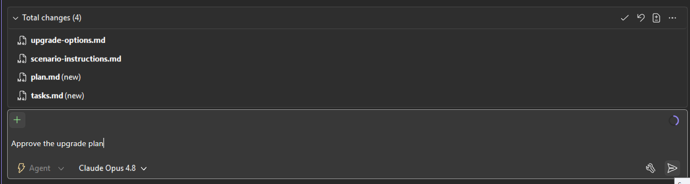

The extension confirms approval and transitions to the **Execution** stage. It reads its own `execution.md` instructions and asks permission to load the `SKILL.md` from the task-execution skill folder. Click **Confirm**.

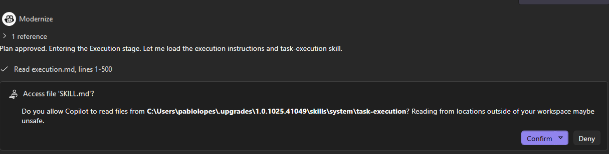

From here, the extension works through the plan one task at a time, **pausing after each task** so you can review the changes and decide whether to continue. This is what Guided Mode buys you — at any point you can stop, edit the code yourself, or steer the extension in a different direction.

---

## 🟢 Task 01 — Prerequisites

The first task is verification only — no code changes, just environment checks. The extension validates the .NET 10 SDK is installed and looks for a `global.json` that might pin a different SDK version.

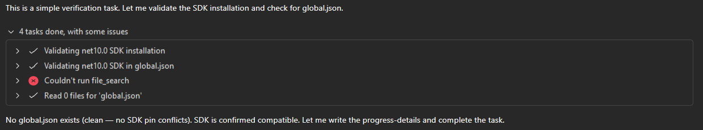

> 💡 **The "Couldn't run file_search" warning is expected** when there's no `global.json` to find — the extension follows up by directly reading the file and confirming it doesn't exist. A missing `global.json` is the *good* outcome here: no SDK pin conflicts.

The extension writes its findings to `progress-details.md` and completes the task:

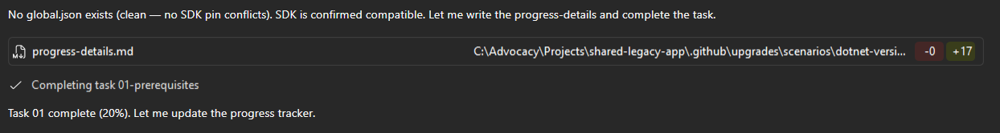

You then get a **Task Complete** summary in the chat with a progress percentage and a preview of what's next:

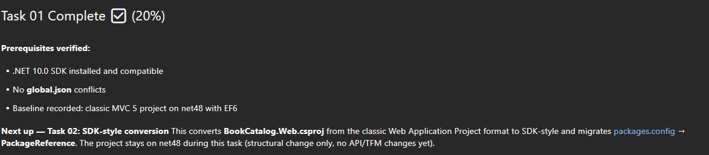

To move on, type **"Continue!"** and send.

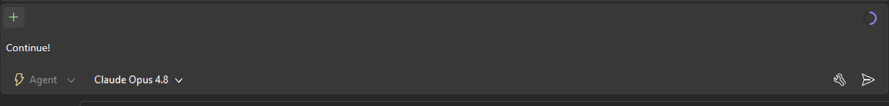

---

## 🟢 Task 02 — SDK-style Conversion

Task 02 rewrites `BookCatalog.Web.csproj` from the classic non-SDK Web Application Project (Wap) format into modern SDK-style format, and migrates `packages.config` to `PackageReference`. **The project stays on `net48` through this task** — so if anything breaks, you know it's structural, not API-related.

The extension starts by loading two relevant skills (one for SDK conversion, one for the Wap → SDK transition):

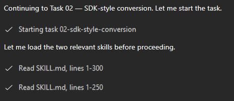

It then enriches `task.md` with project-specific research before running the actual conversion:

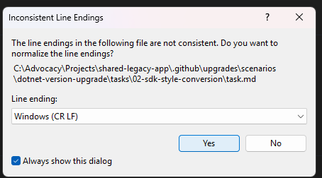

> 💡 **Visual Studio may pop up an "Inconsistent Line Endings" dialog** when the extension edits `task.md`. Pick **Windows (CR LF)** and **Yes** — this is purely cosmetic and doesn't affect the migration.

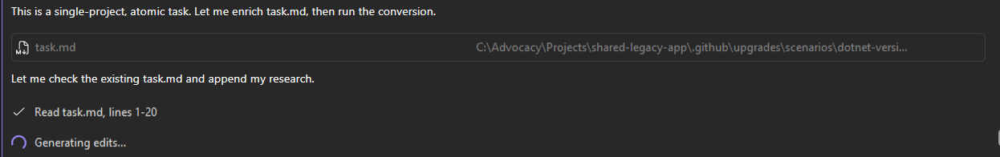

With research enriched, the extension runs the conversion on `BookCatalog.Web.csproj` and verifies `packages.config` is gone:

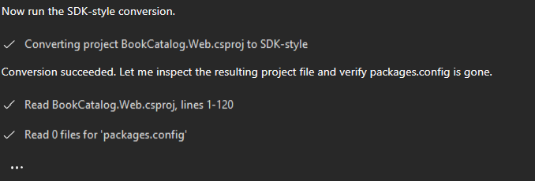

The conversion is done, but the extension hasn't trusted it yet. It asks permission to **build the solution** as a sanity check (still on `net48`):

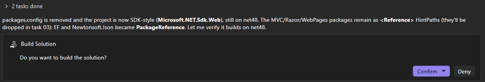

Click **Confirm** — and here's where things get interesting. The first build **fails twice**, and watching how the extension recovers is the most important part of this task:

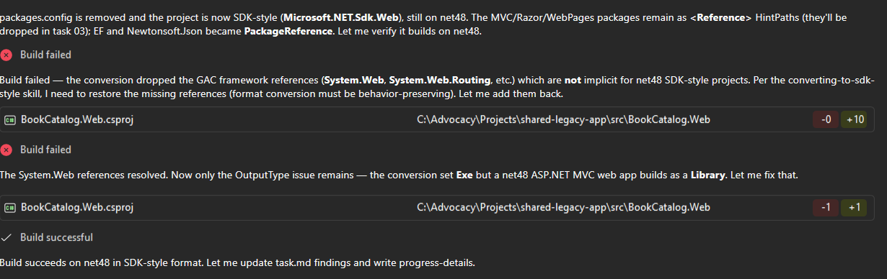

Two distinct conversion-tool mistakes, both auto-corrected:

1. **Build failed #1**: The conversion dropped the `System.Web` / `System.Web.Routing` GAC references that classic Wap projects get implicitly but SDK-style `net48` projects don't. The extension re-added them (+10 lines).
2. **Build failed #2**: The conversion set `OutputType=Exe`, but a `net48` ASP.NET MVC web app builds as a `Library`. The extension flipped it back (-1, +1 line).

After both fixes, the build succeeds on `net48` in SDK-style format. **Task complete:**

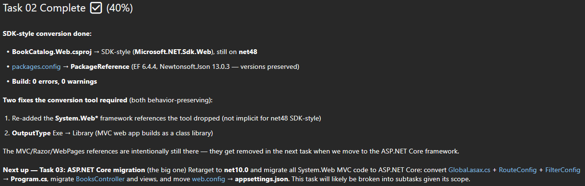

> 💡 **Why this matters:** the extension explicitly flags both fixes as **behavior-preserving** — they restored what the conversion tool dropped, nothing more. The MVC/Razor/WebPages references are intentionally still present; they'll be removed in Task 03 when the project actually moves to ASP.NET Core. Each task does *one thing*, and that discipline is what makes the whole migration debuggable.

Send **"Continue!"** to move on.

---

## 🟠 Task 03 — ASP.NET Core Migration

This is the big one. Task 03 retargets the project to `net10.0` and rewrites all 89 `System.Web.*` API hits — `Global.asax.cs` + `RouteConfig` + `FilterConfig` become `Program.cs`, `BooksController` moves to `Microsoft.AspNetCore.Mvc.Controller` with `IActionResult`, `web.config` becomes `appsettings.json`, Razor views and `_Layout.cshtml` are updated for ASP.NET Core conventions, and the `Microsoft.AspNet.*` packages are dropped.

The extension starts by loading the dedicated MVC migration skill:

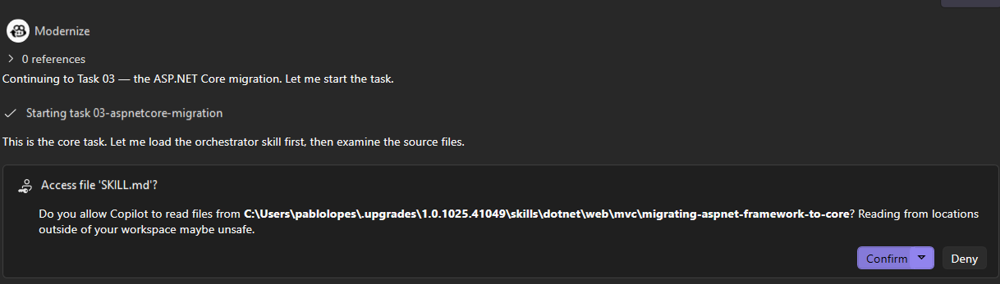

> ⏰ **This task takes the longest** — expect 20–30 minutes of edits across many files. The extension will work through subtasks (controller migration, startup conversion, Razor updates, config migration) and you'll see a steady stream of file edits in the chat. Resist the urge to interrupt; let it finish the subtask group before reviewing.

When task 03 completes, the project file looks dramatically different. Open `BookCatalog.Web.csproj` and you should see a clean SDK-style file targeting `net10.0` with EF Core and Newtonsoft.Json as the only `PackageReference` entries:

Notice what's *missing*: no more `Microsoft.AspNet.Mvc`, no more `Microsoft.AspNet.Razor`, no more `Microsoft.AspNet.WebPages`, no more `Microsoft.Web.Infrastructure`, no more `<Reference>` HintPaths to `System.Web.*`. All of that is now provided by the ASP.NET Core framework reference (`Microsoft.NET.Sdk.Web`).

> 💡 **Why is EF Core already in here?** Task 03 only handles the ASP.NET Core migration — but in Chapter 01 we asked for "Continue. but change to use EF Core instead of keeping EF6", which moved the EF Core package install up into this task's scope. The actual EF6 → EF Core code conversion still happens in Task 04.

Send **"Continue!"** when the task is complete.

---

## 🟢 Task 04 — EF Core Migration

Task 04 finishes the EF6 → EF Core conversion in the data layer. The package was already swapped in Task 03; this task converts the actual code — `ApplicationDbContext`, the `Book` entity, the controller's data access, and the startup wiring.

When the task completes, you get a compact summary table of every area changed:

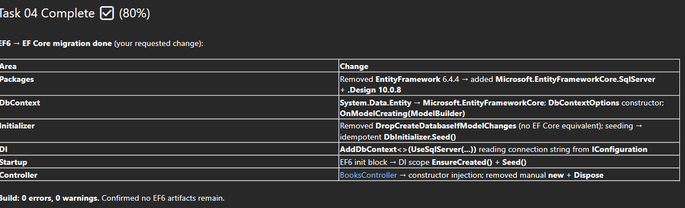

A quick map of what each row means:

| Area | What changed | Why |
|---|---|---|
| **Packages** | Removed `EntityFramework 6.4.4` → added `Microsoft.EntityFrameworkCore.SqlServer` + `.Design` 10.0.8 | EF6 → EF Core provider |
| **DbContext** | `System.Data.Entity` → `Microsoft.EntityFrameworkCore`; `DbContextOptions` constructor; `OnModelCreating(ModelBuilder)` | EF Core uses options-pattern + new ModelBuilder API |
| **Initializer** | Removed `DropCreateDatabaseIfModelChanges` (no EF Core equivalent); seeding → idempotent `DbInitializer.Seed()` | EF Core has no automatic initializers; use migrations or `EnsureCreated()` |
| **DI** | `AddDbContext<>(UseSqlServer(...))` reading from `IConfiguration` | EF Core integrates with the built-in DI container |
| **Startup** | EF6 init block → DI scope `EnsureCreated()` + `Seed()` | The classic `Application_Start` initializer pattern is gone |
| **Controller** | `BooksController` → constructor injection; removed manual `new` + `Dispose` | EF Core `DbContext` lifecycle is managed by DI |

The extension confirms **0 errors, 0 warnings** and explicitly verifies that no EF6 artifacts remain in the codebase. Send **"Continue!"** to kick off the final task.

---

## 🟢 Task 05 — Final Validation

The last task is a full end-to-end verification: clean build, test discovery, and a writeup of any deferred follow-ups.

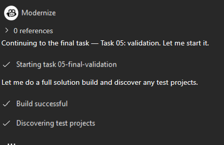

In Visual Studio's **Output** pane you should see a clean, fast build — everything is now up to date:

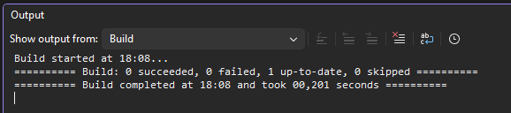

The `1 up-to-date` and `0,201 seconds` build time tells you that **the project compiled fine on the previous task** — Task 05 isn't recompiling, just validating that nothing regressed.

Press **F5** (or **Debug → Start Debugging**) to launch the modernized BookCatalog. The browser opens and the book catalog loads with seeded data:

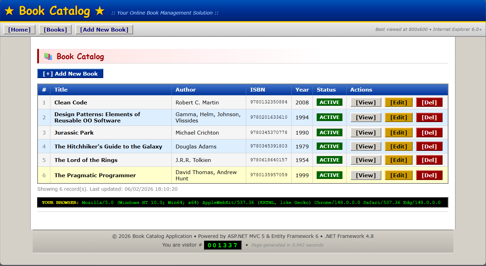

The page even shows your User-Agent string at the bottom — proof that the one `HttpRequestBase.UserAgent` usage from the assessment was successfully migrated to the ASP.NET Core equivalent.

> 💡 **The footer still says "Powered by ASP.NET MVC 5 & Entity Framework 6 · .NET Framework 4.8"** — that's a hardcoded string in `_Layout.cshtml` that the migration didn't touch (it's marketing copy, not API). Updating it is a great "post-upgrade follow-up" task to add to your backlog.

---

## ✅ You're Ready!

You've executed all 5 tasks of the upgrade plan in Guided Mode, watched the extension recover from build failures on its own, and verified that BookCatalog now runs as an SDK-style ASP.NET Core app on .NET 10 with EF Core. In Chapter 03, you'll take this modernized app and deploy it to Azure.

**[Continue to Chapter 03: Going to the Cloud →](../03-cloud/README.md)**

---

## 🔑 Key Takeaways

1. **Guided Mode pauses between every task.** "Continue!" is the magic word — until you send it, nothing moves. That gives you a natural review point after each atomic change.
2. **Tasks are intentionally small and isolated.** Task 02 stayed on `net48` so structural changes were independent from API changes. When build #1 failed in Task 02, you knew exactly where to look.
3. **The extension recovers from its own mistakes.** The conversion tool dropped GAC references and set the wrong `OutputType` — and the extension caught both via the build step and fixed them in-line, marking each as "behavior-preserving."
4. **Progress is real and persisted.** Each task writes to `progress-details.md` and updates a completion percentage. You can stop after any task and resume later without losing state.
5. **Overrides from the Plan phase are honored.** Choosing "Migrate to EF Core" in Chapter 01 propagated into Task 04 automatically — no need to re-state your intent during Execution.
6. **The final result is a clean SDK-style project.** `BookCatalog.Web.csproj` shrank from a 100+ line classic Wap file with `packages.config` and dozens of `<Reference>` entries to a 14-line SDK-style file with 3 `PackageReference` entries. That alone is a maintainability win.

---

## 🛠️ Troubleshooting

**Problem:** The extension stops mid-task and asks you to confirm a Visual Studio dialog (e.g., line endings, save changes, NuGet restore).

**Solution:** This is normal — Visual Studio surfaces dialogs that the extension can't dismiss on its own. Accept the default (e.g., "Yes" / "Save All" / "Restore") and the extension will continue. The "Inconsistent Line Endings" dialog in particular shows up when the extension writes to files Visual Studio already has open.

---

**Problem:** Task 02 build succeeds but Task 03 fails repeatedly on Razor view edits.

**Solution:** Make sure no `.cshtml` files are open in Visual Studio while Task 03 runs — Visual Studio locks open files and the extension can't overwrite them. Close all view tabs and send "Continue!" again to retry the failing subtask.

---

**Problem:** F5 launches the app but you get a SQL connection error.

**Solution:** EF Core uses `EnsureCreated()` to provision the database on first run, but it needs a reachable SQL Server. Check that `appsettings.json` has a valid `ConnectionStrings:DefaultConnection` pointing at your LocalDB instance (e.g., `Server=(localdb)\\MSSQLLocalDB;Database=BookCatalog;Trusted_Connection=True;`). If the connection string didn't carry over from `web.config`, paste it in manually and restart.

---

**Problem:** Task 04 reports "EF6 artifacts remain" and won't complete.

**Solution:** The validation looks for leftover `using System.Data.Entity` or `EntityFramework` references. Search the solution for either string and remove any that the migration missed. Stragglers are usually in `.cshtml` files (rare) or in test/helper projects (more common in larger solutions).

---

## 📚 Learn More

- 📘 [Migrate from ASP.NET MVC to ASP.NET Core MVC](https://learn.microsoft.com/aspnet/core/migration/mvc) — the technical deep dive Task 03 is based on
- 📘 [Port from EF6 to EF Core](https://learn.microsoft.com/ef/efcore-and-ef6/porting/) — what changed between the two ORMs
- 📘 [.NET SDK-style project format](https://learn.microsoft.com/dotnet/core/project-sdk/overview) — why the new csproj is so much shorter
- 📘 [System.Web Adapters for ASP.NET Core](https://learn.microsoft.com/aspnet/core/migration/inc/overview) — the compatibility shim we *didn't* use (and when you might want to)
