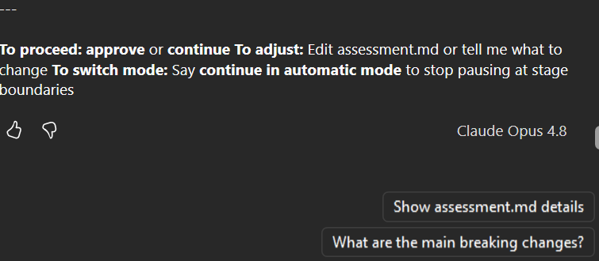
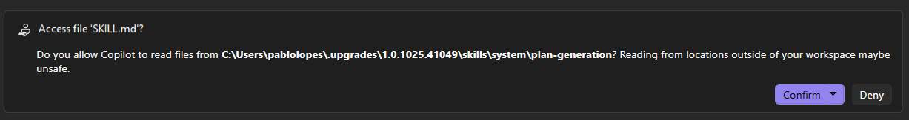
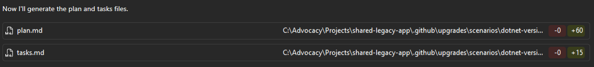
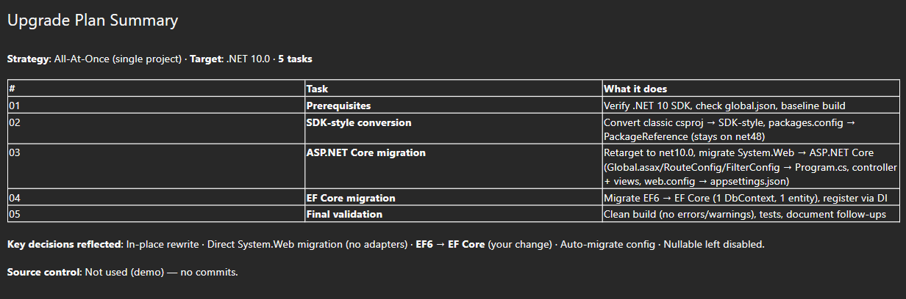

# Chapter 02: Planning

Chapter 01 gave you assessment artifacts. This chapter converts those findings into an execution-ready plan.

The goal here is not code changes yet. The goal is decision quality: what to do first, what to defer, and how to gate execution so failures stay isolated.

## 🎯 Learning Objectives

By the end of this chapter, you'll have:
- Turned assessment findings into a prioritized migration strategy
- Chosen key trade-offs (in-place vs side-by-side, inline fixes vs deferred fixes)
- Generated plan artifacts (`upgrade-options.md`, `plan.md`, `tasks.md`)
- Defined stop/go checkpoints before code execution

---

## ✅ Prerequisites

**From Chapter 01:**
- Assessment report reviewed and understood
- Blockers, warnings, and informational findings identified
- Initial risk notes captured

---

## 🗺️ Generating the Upgrade Plan

Once you've read the report in your Guided Mode session, the extension asks: **"To proceed: approve or continue To adjust: Edit assessment.md or tell me what to change To switch mode: Say continue in automatic mode to stop pausing at stage boundaries**

At the end of the assessment, Guided Mode pauses and prompts you with three options:

- **To proceed**: approve or say "continue"
- **To adjust**: edit `assessment.md` directly or tell the extension what to change in chat
- **To switch mode**: say "continue in automatic mode" to stop pausing at stage boundaries

Before continuing, this is your chance to amend the assessment if you spot a false positive or want to reprioritize something. For example, you could say: "In the assessment, please mark the `System.Web.Mvc` hits in `AdminController.cs` as informational instead of blockers, since those pages are low-priority for the upgrade."

The extension then moves to the **Plan** phase. It takes the assessment findings and first surfaces a set of **upgrade strategy questions** — one decision at a time, each with a recommendation pre-selected and an explanation of why. The output is saved in `upgrade-options.md` in your project.

**Walk through each question, then at the end you'll send a single message to confirm your choices (or override any default).** We'll come back to that message at the end of this section.

Let's walk through each decision BookCatalog triggers.

### Upgrade Strategy

The first question is how to spread the migration across time. Because BookCatalog is a single project, the extension has only one option:

| Value | Description |
|-------|-------------|
| **All-at-Once** (selected) | The single project is converted to SDK-style, retargeted to net10.0, and all code migrated in one coordinated pass. |

For multi-project solutions you'd also see **Strangler Fig** (migrate one project at a time from the bottom up). With a single project there's no dependency chain to work through, so all-at-once is the only sensible choice.

### Project Structure

Next, how to physically restructure the project during the migration:

| Value | Description |
|-------|-------------|
| **In-place rewrite** (selected) | Replaces the Framework web project with an ASP.NET Core project in one pass. No YARP proxy, no parallel projects. |
| Side-by-side | Creates a new ASP.NET Core project alongside the old one with a YARP proxy; assets migrate incrementally while the old app stays live. Better for large web surfaces. |

BookCatalog is small (1 controller, ~633 LOC), so in-place is the cleaner fit. **Side-by-side** is worth knowing about for larger apps: it keeps the old site live while the new one is built alongside it, routing traffic gradually via a reverse proxy.

> 💡 **YARP** (Yet Another Reverse Proxy) is a Microsoft toolkit used in the side-by-side pattern to route incoming HTTP requests between the old ASP.NET Framework app and the new ASP.NET Core app. This lets you migrate and test incrementally while the old app stays live — at the cost of added infrastructure complexity.

### APIs and Frameworks

89 `System.Web.Mvc` API changes, all with known ASP.NET Core equivalents. The extension recommends resolving them inline:

| Value | Description |
|-------|-------------|
| **Fix Inline** (selected) | Resolve every API change in the same task, including complex ones. No deferred stubs to clean up later. |
| Defer Complex Changes | Stub complex changes to keep the project building, resolve in follow-up subtasks. Better for large bottom-up upgrades. |

**Defer Complex Changes** is the escape hatch for large solutions where you want the project to compile at every step (useful in CI). For BookCatalog, all 89 issues are known patterns, fixing them inline gives you a clean codebase in one pass.

### Entity Framework

EF6 6.4.4 is detected with a single `DbContext`. The extension flags an important choice here:

| Value | Description |
|-------|-------------|
| **Keep EF6** (selected) | Upgrade EF6 to 6.5.2 and run it on net10.0. Migrate to EF Core later as a separate effort. Lowest risk. |
| Migrate to EF Core | Migrate Entity Framework simultaneously with the .NET upgrade. Two sources of breaking changes at once. |

As we are already doing an architectural migration (System.Web → ASP.NET Core), **we will migrate to Core**, as this is a simple app and we want to get all the benefits of EF Core right away. In a larger app with a complex data layer, it might be safer to *keep* EF6 for now, get the app running on .NET 10, then tackle EF Core as a separate project.

### Configuration

`web.config` holds standard connection strings and `appSettings` — nothing unusual:

| Value | Description |
|-------|-------------|
| **Auto-migrate to .NET Core Configuration** (selected) | Converts web.config to appsettings.json and migrates code to IConfiguration. |
| Manual Migration with Mapping Document | Generates a detailed settings mapping first. More control for complex configs. |

**Manual Migration** is for apps where `web.config` has custom config sections, encrypted values, or environment-specific transforms that need human review before touching. BookCatalog's config is standard, so auto-migration handles it.

With all strategy decisions reviewed, you're ready to generate the final plan. The extension synthesizes all of this into a prioritized sequence of atomic tasks.

Type: **"Continue. Change to use EF Core instead of keeping EF6"** and send. This overrides the default EF6 choice to include the EF Core migration in the same pass as the .NET upgrade — a reasonable call for a small app like BookCatalog.

---

## Plan Output

When you send that message, it then updates `upgrade-options.md` to reflect your change and confirms it understood. Then the extension acknowledges the override and first asks permission to load the `SKILL.md` from its plan-generation module. Click **Confirm**.

It generates the two plan artefacts — `plan.md` (+60 lines) and `tasks.md` (+15 lines) — in your project's `.github/upgrades/scenarios/dotnet-version-upgrade/` folder:

Finally, the extension then synthesizes the assessment findings and all strategy decisions into an **Upgrade Plan Summary** in the chat — a quick table you can review before the full plan files are written:

---

## 5-Task Breakdown

The full content of `plan.md` is your Chapter 02 roadmap. It has 5 ordered tasks, each with a clear scope and a "Done when" condition so you know exactly when to move to the next:

**Task 01 — Prerequisites**: Verify .NET 10 SDK is installed, check `global.json` for SDK pins, establish a baseline build. No code changes — just environment validation before anything else runs.

**Task 02 — SDK-style conversion**: Rewrite `BookCatalog.Web.csproj` from classic Wap format to SDK-style and swap `packages.config` for `PackageReference`. The project stays on `net48` through this task so structural and API changes don't mix.

**Task 03 — ASP.NET Core migration**: The main event. Retarget to `net10.0` and replace all 89 `System.Web.*` API hits:
- `Global.asax.cs` + `RouteConfig` + `FilterConfig` → `Program.cs` startup pipeline
- `BooksController` → `Microsoft.AspNetCore.Mvc.Controller`, `IActionResult`, `NotFound()`, `RedirectToAction`, `ValidateAntiForgeryToken`, `ModelState`
- `HttpRequestBase.UserAgent` → ASP.NET Core equivalent
- `web.config` → `appsettings.json` + `IConfiguration`
- Razor views + `_Layout.cshtml` updated for ASP.NET Core conventions
- `Newtonsoft.Json` bumped to 13.0.4; `Microsoft.AspNet.*` packages dropped

**Task 04 — EF Core migration**: Migrate the data layer from EF6 to EF Core (`ApplicationDbContext` + `Book` entity). Replace the `EntityFramework` package with EF Core provider packages, convert the `DbContext` to the options-pattern constructor, register via DI in `Program.cs`, and handle EF6-specific patterns (database initializers → `EnsureCreated`, lazy-loading config).

**Task 05 — Final validation**: Clean build (zero errors, zero warnings), app starts, any tests pass. Document deferred follow-ups (nullable reference types, EF Core migrations).

> 💡 **Why 5 tasks instead of 1?** The plan deliberately isolates failure modes. If task 03 introduces a regression, you know it came from the ASP.NET Core migration — not the SDK conversion or the EF change. Each task is atomic and independently verifiable via its "Done when" condition.

After reviewing the plan summary in the chat, open `plan.md` to see the full details. You can edit this file to adjust task scopes, add notes, or split/merge tasks as needed. The key is that the plan is a living document — generated by the extension but owned and maintained by you.

---

## 🎓 Key Takeaways

1. **Assessment quality determines plan quality.**
   Planning is only as good as the assessment report. If the assessment missed an incompatibility, your plan will too. Spend time validating the assessment before moving forward.

2. **Strategy decisions have trade-offs.**
   All-at-Once is faster but riskier. Strangler Fig is slower but safer. There is no "perfect" strategy—only the right one for your constraints (timeline, team, risk tolerance).

3. **Plan artifacts are living documents.**
   Your `upgrade-options.md`, `plan.md`, and `tasks.md` will change as execution reveals new issues. Treat them as hypotheses, not law. Update them as you learn.

4. **Task isolation reduces risk.**
   Each task should be small enough to test, revert, and understand. If a task takes more than 1 day or touches more than one system, break it further.

5. **Defer decisions explicitly.**
   If you defer an item (e.g., "optimize LINQ queries later"), document it in `upgrade-options.md` with rationale. Implicit deferral means hidden tech debt.

6. **Plan approval is your quality gate.**
   Don't move to execution until all stakeholders agree:
   - Strategy decisions are sound
   - Risk notes are acknowledged
   - Tasks are achievable in the allocated time
   - Success criteria are clear

7. **Feedback loops beat perfect upfront planning.**
   Your plan will be wrong in some way. That's OK. Execute Phase 1, measure results, update the plan. Repeat. Migrating a large app to .NET 10 is not a waterfall—it's iterative.

---

## ✅ You're Ready!

You now have a planning artifact set ready for execution. Phase 01 gave you visibility into what's broken. Phase 02 gave you a strategy and a phased roadmap. Phase 03 is where you execute those tasks and build the new application.

**[Continue to Chapter 03: Upgrade Execution →](../02-modernizing/README.md)**

---

## 📚 Learn More

- [GitHub Copilot app modernization for .NET](https://learn.microsoft.com/dotnet/core/porting/github-copilot-app-modernization-overview)
- [Port from .NET Framework to .NET](https://learn.microsoft.com/dotnet/core/porting/)
- [Migrate from System.Web to ASP.NET Core](https://learn.microsoft.com/dotnet/core/porting/net-framework-to-core-migration)
- [Entity Framework 6 to Entity Framework Core migration guide](https://learn.microsoft.com/ef/efcore/what-is-new/ef6-efcore-porting/)
- [Configuration in .NET](https://learn.microsoft.com/dotnet/core/extensions/configuration)
