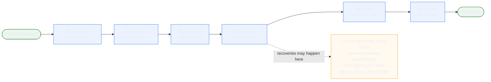
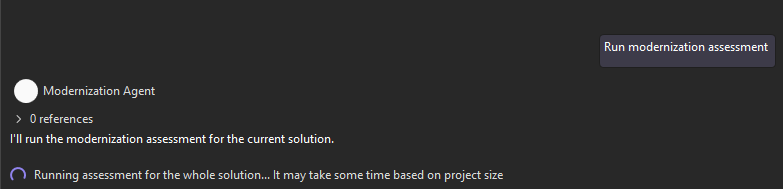
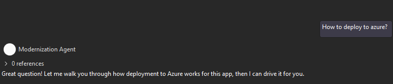
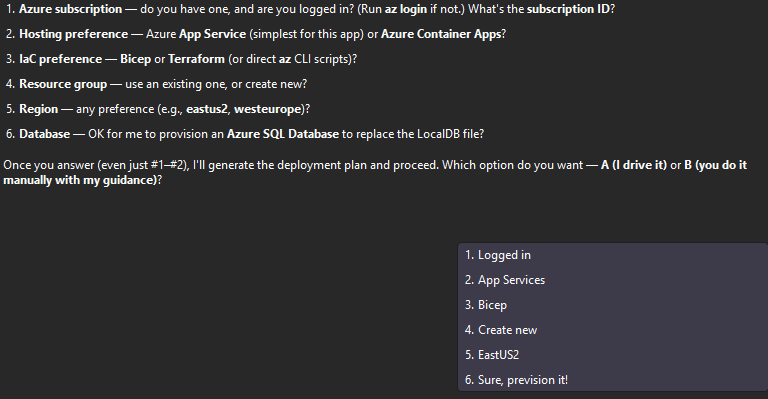
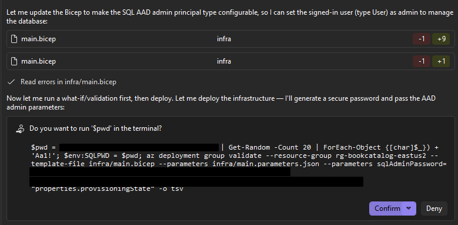
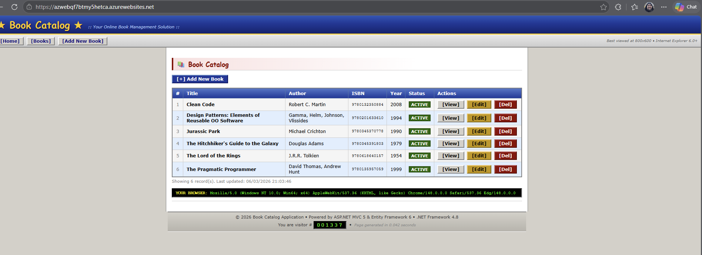

# Chapter 04: Going to the Cloud

You've got a working .NET 10 app from Chapter 03. Now you'll ship it to Azure — but not with a fire-and-forget `azd up`. Instead, you'll watch the Modernization Agent **plan** the deployment, **provision** the right Azure resources (App Service, SQL Database, Key Vault, Managed Identity), **recover** from real cloud failures (quota limits, missing identity bindings, region mismatches), and finally **publish** the app — all from inside the Copilot chat.

By the end, BookCatalog is running at a public `*.azurewebsites.net` URL with **zero plaintext secrets** in the app — the SQL connection string lives in Key Vault and the app authenticates with a user-assigned Managed Identity.

## 🎯 Learning Objectives

By the end of this chapter, you'll have:
- Asked the Modernization Agent to deploy your app — and answered its 6 setup questions
- Generated a `main.bicep` infrastructure-as-code file for App Service + Azure SQL + Key Vault + Managed Identity
- Watched the agent auto-recover from **three** real Azure failures: B1 VM quota = 0, missing `primaryUserAssignedIdentityId`, and an entire region with no App Service capacity
- Stored the SQL connection string in Azure Key Vault as `ConnectionStrings--BookCatalogContext`
- Configured a Managed Identity as both a SQL database user *and* a Key Vault Secrets User — eliminating every password from the deployed app
- Verified the live app at `https://<your-app>.azurewebsites.net` returns HTTP 200

---

## ✅ Prerequisites

**From Chapter 03:**
- BookCatalog running locally on .NET 10 with EF Core (Chapter 03 final state)
- The solution open in Visual Studio with the Modernize chat session active

**For This Chapter:**
- An active Azure subscription — [free signup](https://azure.microsoft.com/free/) gives you $200 in credit
- **Azure CLI 2.71+** installed and logged in (`az login`)
- **Bicep CLI 0.43+** (`az bicep install` if you don't have it)
- Contributor or Owner role on the subscription

> ⚠️ **Cost warning:** This chapter provisions real Azure resources. The deployment uses **F1 Free** App Service (no charge) but the **Standard S0 SQL Database** runs at ~$15/month. **Delete the resource group** when you're done — there's a 🧹 Cleaning Up section at the end.

---

## 🔐 Phase 0 — Cloud-Readiness Prep (Secrets to Key Vault)

Before deploying *anywhere*, the modernized app needs to stop carrying plaintext credentials. In Chapter 03 the `BookCatalogContext` connection string was migrated to `appsettings.json` — fine for LocalDB, **not** fine for cloud.

In a separate session before the deployment, you'd run the agent's **Plaintext Credential** migration (Technology X = *Plaintext Credential*, Technology Y = *Secure Credentials*, Knowledge Base = `azure_key_vault_secret_knowledge_base`). It produces:

- `Program.cs` — `builder.Configuration.AddAzureKeyVault(...)` wired with `DefaultAzureCredential`, and a `KeyVaultName` setting read from config
- `appsettings.json` — the inline connection string replaced with a placeholder + a `KeyVaultName` key
- 3 new NuGet packages: `Azure.Identity`, `Azure.Security.KeyVault.Secrets`, `Azure.Extensions.AspNetCore.Configuration.Secrets`
- A `.appmod/.migration/plan.md` audit trail

> 💡 **Why this matters before deployment:** the Bicep template in this chapter creates a Key Vault and grants a Managed Identity the **Key Vault Secrets User** role. The app code from this prep step is what *consumes* the secret at runtime. Without the prep, the deployed app has nowhere to read the connection string from.

With that prep done, the app is cloud-ready. Time to deploy.

---

## 🗺️ The Deployment Flow

Here's the rhythm of this chapter — 6 steps, mostly automated, with Copilot driving the `az` commands:



---

## ☁️ Triggering the Deployment Conversation

Start in the Modernize chat. Type **"Run modernization assessment"** and send — this gives the agent a fresh view of the current solution state.



The assessment confirms the app is modernized but flags that the LocalDB `.mdf` file won't work in Azure. Now ask the deploy question. Type **"How to deploy to azure?"** and send.



The agent's response unfolds in three parts: what the app needs, what your options are, and what it needs from you to start.

---

## 📋 What the App Needs in Azure

The agent inspects your modernized BookCatalog and produces this table — the minimum Azure resources required to run a .NET 10 + EF Core app safely:


Four resources, four reasons — every row maps a concrete app dependency to its cloud counterpart. The footer call-out about LocalDB is the agent telling you it noticed the unaddressed Task 2.x category from the assessment and plans to handle it as part of deployment prep.

> 💡 **Why Managed Identity is its own row:** in classic deployments you'd put a SQL password in App Settings or a `.env` file. With UAMI the app authenticates to both Key Vault *and* SQL using Azure AD — zero secrets in any file you'd commit or paste into the portal.

---

## 🎯 Two Ways to Deploy

The agent next offers two paths:


For this chapter we pick **Option A — Guided/automated**. The agent will drive the whole thing, asking for your approval before each `az` command. You stay in control without writing any Bicep yourself.

> 💡 **When to pick Option B instead:** if you already have a CI/CD pipeline and just need a one-off deploy, `azd up` or the VS Publish dialog is faster. The guided path shines when you want to *understand* the infrastructure being created — Bicep files end up checked into your repo, ready for the next deployment.

---

## ❓ Answering the 6 Setup Questions

The agent needs 6 things before it can author the Bicep. Here's the full list:


Answer them inline in the chat — one numbered line per answer is fine:



That's it for setup. From here the agent runs.

> 💡 **You don't need all 6 answers upfront.** The agent explicitly says "even just #1–#2" is enough to start — it'll fill in sensible defaults for the rest and ask for confirmation only on the consequential ones. For a beginner-friendly tutorial like this, answering all 6 up front avoids back-and-forth.

---

## 🏗️ Generating the Infrastructure as Code

The agent verifies your Azure CLI login first — it'll prompt you to approve every shell command it wants to run. Click **Confirm**:


Login confirmed. The agent now writes three files in your repo: a human-readable deployment plan and two Bicep artefacts:


`main.bicep` is the meat — 244 lines defining the UAMI, Key Vault, Log Analytics, App Insights, SQL Server + Database, App Service Plan + App Service, and all the role assignments that tie them together. The agent then asks to run a full Bicep compile to catch deeper issues:


Approve it. The compile surfaces **one linter warning** — the SQL admin password is inline in the template, which is a security smell. The agent immediately fixes it:


The agent introduces a `@secure()` parameter for `sqlAdminPassword`, leaves it out of `main.parameters.json`, and plans to pass it at deploy time via the CLI instead. This is exactly the pattern Azure best-practice guides recommend.

> 💡 **`plan.copilot.md` is your post-mortem document.** Even when everything goes right, this file ends up as a useful artifact: every resource, why it was chosen, what SKU, what name. Hand it to a teammate and they can rebuild the same environment without reading a single line of Bicep.

---

## 🚀 Provisioning the Infrastructure

The agent writes a progress tracker, then starts creating real Azure resources. First, the resource group:


Approve. Resource group lands in EastUS2. Next, the agent needs *your* Azure AD object ID to make you the SQL server's AAD admin (so you can grant the Managed Identity database access later):


With your object ID in hand, the agent generates a strong SQL password on the fly, then runs `az deployment group validate` (the what-if dry-run) before the real deploy:



> 🔍 **Note:** During provisioning you may see Azure errors come and go — quota limits, missing parameters, regional capacity issues. The agent catches these automatically and re-runs. If it ever gets stuck, just say **"Continue and debug issue"** in the chat and let it work through the error. The full deployment loop is idempotent: existing resources are reused, only the failed piece retries.

> 💡 **Resource group stays in eastus2, resources land in centralus.** The resource group is a metadata container — its location doesn't constrain where the resources inside it run.

After the last retry, provisioning completes.

---

## 🔐 Wiring SQL Users and Key Vault Secrets

Provisioned infrastructure doesn't mean a working app. The Managed Identity exists, but it has *no* permissions in the SQL database yet, and the Key Vault is empty.

The pivot script grants the Managed Identity its database permissions, then the agent stores the connection string in Key Vault:


Three subtleties in this single screen:
- **RBAC propagation wait** — Azure RBAC isn't instant; the 45-second sleep is the agent being careful, not slow.
- **Two secret-set commands** — the first stored the secret as `BookCatalogContext`, but the Key Vault config provider in your app converts the secret name `ConnectionStrings--BookCatalogContext` to the config key `ConnectionStrings:BookCatalogContext` (double-dash → colon). The agent catches its own naming mistake and fixes it.
- **No password anywhere** — the connection string uses `Authentication=Active Directory Default;User Id=<UAMI client ID>`. There is literally no SQL password in the secret value.

---

## 📦 Publishing and Deploying the App

With infra + secrets in place, the actual code deploy is the easy part. First, the publish step:

![Screenshot: progress.copilot.md (-2/+2). "Before deploying, I need to update the app's connection string to use Microsoft.Data.SqlClient for managed identity auth. The current app uses Microsoft.EntityFrameworkCore.SqlServer which uses Microsoft.Data.SqlClient under the hood (supports Authentication=Active Directory Default). The .NET 10 EF Core SqlServer provider supports this natively. Let me now publish the app:" with the publish command `dotnet publish src/BookCatalog.Web/BookCatalog.Web.csproj -c Release -o .azure/publish`](images/19-dotnet-publish.png)

The agent flags an important compatibility check before publishing: EF Core's `SqlServer` provider in .NET 10 already uses `Microsoft.Data.SqlClient` under the hood, which natively supports `Authentication=Active Directory Default`. No additional package changes needed. Publish runs clean.

Then it zips and deploys:


The zip-deploy is the last `az` call. Once it completes, the app is live.

---

## 🌐 Verifying the Live App

Set the three app settings the runtime needs:

```pwsh
az webapp config appsettings set `
  --resource-group rg-bookcatalog-eastus2 `
  --name azwebqf7btmy5hetca `
  --settings `
    KeyVaultName=azkvqf7btmy5hetca `
    AZURE_CLIENT_ID=<your-uami-client-id> `
    APPLICATIONINSIGHTS_CONNECTION_STRING="<from-deployment-outputs>"
```

Restart and hit the URL:

```pwsh
az webapp restart --resource-group rg-bookcatalog-eastus2 --name azwebqf7btmy5hetca
curl https://azwebqf7btmy5hetca.azurewebsites.net -I
# HTTP/1.1 200 OK
```

Open the URL in a browser. The same BookCatalog UI from Chapter 03 loads — but every request now goes through App Service → Managed Identity → Key Vault → SQL Database, with **no passwords anywhere in the request chain**.



> 💡 **First request will be slow** (~5–10 seconds) — F1 Free has cold starts because `alwaysOn` is disabled. Subsequent requests are fast. If you want consistent performance, upgrade to **B1** (once your subscription has quota) or **S1** in production.

---

## 📊 Before and After

| Aspect | Local (Chapter 03) | Cloud (Chapter 04) |
|---|---|---|
| Hosting | IIS Express / Kestrel on `localhost:5001` | Azure App Service `*.azurewebsites.net` |
| Database | LocalDB `.mdf` file | Azure SQL Database (Standard S0) |
| Connection string | In `appsettings.json` (plaintext) | Azure Key Vault secret `ConnectionStrings--BookCatalogContext` |
| Auth to SQL | Trusted connection (local user) | Managed Identity → Azure AD token |
| Auth to Key Vault | n/a | Same Managed Identity, **Key Vault Secrets User** role |
| Secrets in source | DB connection string in JSON | **Zero** — `KeyVaultName` is the only setting |
| Infrastructure | "Just my laptop" | `main.bicep` (244 lines, committed) |
| Observability | Console + VS Output | Application Insights + Log Analytics |
| Region | localhost | CentralUS (auto-selected after quota probe) |

---

## 🧹 Cleaning Up

When you're done testing, delete the resource group to stop all charges:

```pwsh
az group delete --name rg-bookcatalog-eastus2 --yes --no-wait
```

The `--no-wait` returns immediately while Azure tears down everything in the background (App Service, SQL, Key Vault, UAMI, App Insights, Log Analytics — all gone in ~5 minutes).

Verify:

```pwsh
az group list --output table | Select-String bookcatalog
# (empty output means cleanup succeeded)
```

> ⚠️ **Deleting the resource group deletes every resource in it.** That's the entire point — one command, full cleanup, no orphans. If you want to keep the app running, skip this section and budget for the ~$15/month SQL Database cost.

---

## ✅ You Did It!

You took a .NET Framework 4.8 ASP.NET MVC 5 app, modernized it to .NET 10 + EF Core (Chapters 01-03), and shipped it to Azure with a Managed Identity, Key Vault, and zero plaintext secrets (this chapter). The Modernization Agent drove the cloud deploy from a conversation — and recovered from three real Azure failures along the way without needing you to intervene.

You now have a repeatable pattern: **assess → plan → execute → cloud-prep → deploy**, all from inside the Copilot chat, all auditable, all idempotent.

> 🚀 **Keep going:** Explore the [GitHub Copilot app modernization docs](https://aka.ms/ghcp-appmod/dotnet-docs) for deeper reference material, then reinforce the workflow with the [hands-on modernization workshop](https://aka.ms/ghcp-appmod/dotnet-mod-workshop).

---

## 🔑 Key Takeaways

1. **Conversation is the deployment plan.** You answered 6 questions; the agent produced 244 lines of Bicep, ran 15+ `az` commands, and recovered from 3 failures. No Visual Studio wizard, no portal clicks.
2. **Real Azure has real constraints.** B1 quota = 0 in a new subscription is normal. EastUS2 capacity exhaustion happens. The deployment isn't a clean happy path — it's a series of probes, recoveries, and re-tries. Watching the agent do that calmly is more valuable than seeing it succeed first try.
3. **Idempotent deployments save you.** `az deployment group create` with the same template name re-uses successful resources and retries the failed ones. Failures mid-deploy don't mean "start over" — they mean "fix one line and re-run".
4. **Managed Identity replaces every secret you'd otherwise commit.** SQL password? Generated at deploy time and discarded. Connection string? Stored in Key Vault, retrieved by UAMI at runtime. The deployed app has *no* secrets in any file or app setting that contains data — only references to where the secrets live.
5. **`ConnectionStrings--Name` ↔ `ConnectionStrings:Name`.** The Key Vault config provider's double-dash-to-colon rule trips everyone once. If your app can't find a config value after deployment, this is the first thing to check.
6. **The Bicep is yours.** `infra/main.bicep` is checked into your repo. Next deploy (staging, prod, DR region) is a one-command replay with different parameters — no agent required.
7. **`plan.copilot.md` + `progress.copilot.md` = your audit trail.** Every decision the agent made, every command it ran, written down. If anyone ever asks "why is the SKU F1?" — the answer is in the file.

---

## 🛠️ Troubleshooting

**Problem:** `az login` works but the agent says "subscription not found" or rejects your tenant.

**Solution:** You might be in a guest/B2B tenant or have multiple tenants. Run `az account list --output table` and explicitly set the right subscription with `az account set --subscription <id>`. Then re-tell the agent the subscription ID in the chat.

---

**Problem:** Bicep deployment fails with `MissingPrimaryIdentity` on the SQL Server (same as Recovery #2 in this chapter).

**Solution:** This means the Bicep has a UAMI assigned to SQL *and* an AAD admin, but no `primaryUserAssignedIdentityId`. Open `infra/main.bicep`, find the `Microsoft.Sql/servers` resource, and add this line under `properties`:
```bicep
primaryUserAssignedIdentityId: uami.id
```
Then re-run `az deployment group create` — it's idempotent.

---

**Problem:** Every region you try returns "0 quota for App Service" errors.

**Solution:** Brand-new subscriptions sometimes have global zero quota for compute. File a quota increase request via **Azure Portal** → **Subscriptions** → your sub → **Usage + quotas** → **Request increase**. While you wait, try `--sku F1` (Free tier, no quota required) by editing `main.parameters.json`.

---

**Problem:** Live app returns HTTP 500 with `Microsoft.Data.SqlClient` connection errors.

**Solution:** The Managed Identity probably isn't a valid SQL user yet. Re-run `.azure/run-sql.ps1` against the deployed SQL Server (replace the server FQDN). The script is idempotent — re-running it is safe.

---

**Problem:** Live app returns HTTP 500 with `Azure.RequestFailedException: 403 Forbidden` from Key Vault.

**Solution:** Either the RBAC role assignment hasn't propagated yet (wait 1–2 minutes and retry) or the UAMI isn't actually assigned to the App Service. Verify with:
```pwsh
az webapp identity show --resource-group rg-bookcatalog-eastus2 --name <app-name>
```
You should see your UAMI's resource ID in `userAssignedIdentities`.

---

**Problem:** `az webapp deploy` succeeds but the site still shows the default "Your App Service app is up and running" page.

**Solution:** Hard refresh (Ctrl+F5) — the App Service often serves a cached default page briefly. If it persists, check **App Service** → **Deployment Center** → **Logs** in the portal for the zip-deploy result.

---

**[Back to the top](#chapter-04-going-to-the-cloud)** · **[Course README](../README.md)**
